# 🌟 별빛뉴스

> 흩어진 뉴스를 연결해, 사건의 맥락을 따라 탐색하는 지식 그래프 기반 뉴스 서비스

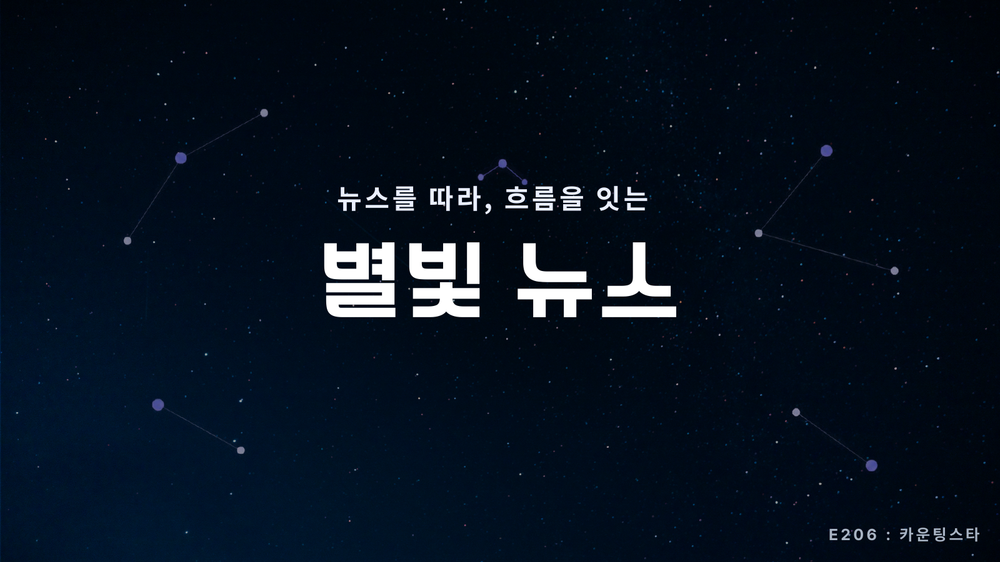

별빛뉴스는 여러 언론사의 기사를 **Event 단위로 통합**하고, 사건·인물·기관·장소·시점·주장의 관계를 지식 그래프로 제공합니다. 사용자는 오늘의 주요 사건에서 출발해 관련 기사와 주변 지식을 탐색하고, 읽은 기사와 탐색 기록을 자신만의 지식 지도로 축적할 수 있습니다.

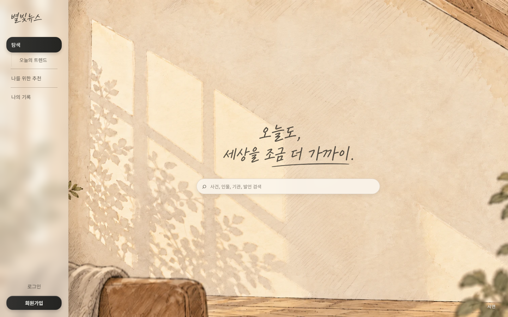

## 목차

- [서비스 소개](#서비스-소개)
- [주요 기능](#주요-기능)
- [핵심 차별점](#핵심-차별점)
- [서비스 이용 흐름](#서비스-이용-흐름)
- [시스템 아키텍처](#시스템-아키텍처)
- [스케줄링과 배치 설계](#스케줄링과-배치-설계)
- [데이터 및 AI 처리 과정](#데이터-및-ai-처리-과정)
- [지식 그래프 모델](#지식-그래프-모델)
- [주변 노드 탐색과 점수 설계](#주변-노드-탐색과-점수-설계)
- [개인화 추천과 평가 설계](#개인화-추천과-평가-설계)
- [기술 스택](#기술-스택)
- [주요 API](#주요-api)
- [프로젝트 구조](#프로젝트-구조)
- [로컬 실행](#로컬-실행)
- [배포 환경](#배포-환경)
- [테스트](#테스트)
- [팀원](#팀원)

## 서비스 소개

기존 뉴스는 같은 사건을 다룬 기사도 언론사별로 흩어져있습니다. 사건의 주체와 대상, 관련 인물, 후속 보도를 파악하려면 사용자가 여러 기사를 직접 검색하고 연결해야 합니다. 읽은 기록도 기사 목록으로만 남기 때문에 어떤 분야와 지식을 쌓아 왔는지 확인하기 어렵습니다.

별빛뉴스는 이 문제를 다음과 같이 해결합니다.

| 기존 뉴스 소비의 문제 | 별빛뉴스의 해결 방법 |
| --- | --- |
| 동일 사건의 기사가 언론사별로 흩어짐 | 여러 기사를 실제 사건 단위의 Event로 통합 |
| 기사 사이의 관계를 직접 찾아야 함 | Event·Entity·Statement·Time을 그래프로 연결 |
| 읽은 뉴스가 단순한 목록으로만 남음 | 읽기와 탐색 기록을 개인 지식 그래프로 축적 |
| 유사한 뉴스가 반복 추천됨 | 콘텐츠·협업 필터링을 결합하고 Story 단위로 중복 제어 |

### 프로젝트 개요

| 항목 | 내용 |
| --- | --- |
| 서비스명 | 별빛뉴스 |
| 팀명 | 카운팅스타 |
| 서비스 분야 | 뉴스 탐색·추천 |
| 뉴스 분야 | 정치·경제·사회·문화·국제·스포츠·IT·과학 |
| 핵심 기술 | Knowledge Graph, NLP, Event Embedding, Hybrid Recommendation |

## 주요 기능

### 1. 오늘의 뉴스 그래프

- 최근 기사에서 집계한 주요 Event를 오늘의 트렌드로 제공합니다.
- Event를 선택하면 주변의 Entity·Statement·Time과 관계를 확장해 볼 수 있습니다.
- 선택한 Node와 관련된 여러 언론사의 기사를 한곳에서 확인할 수 있습니다.

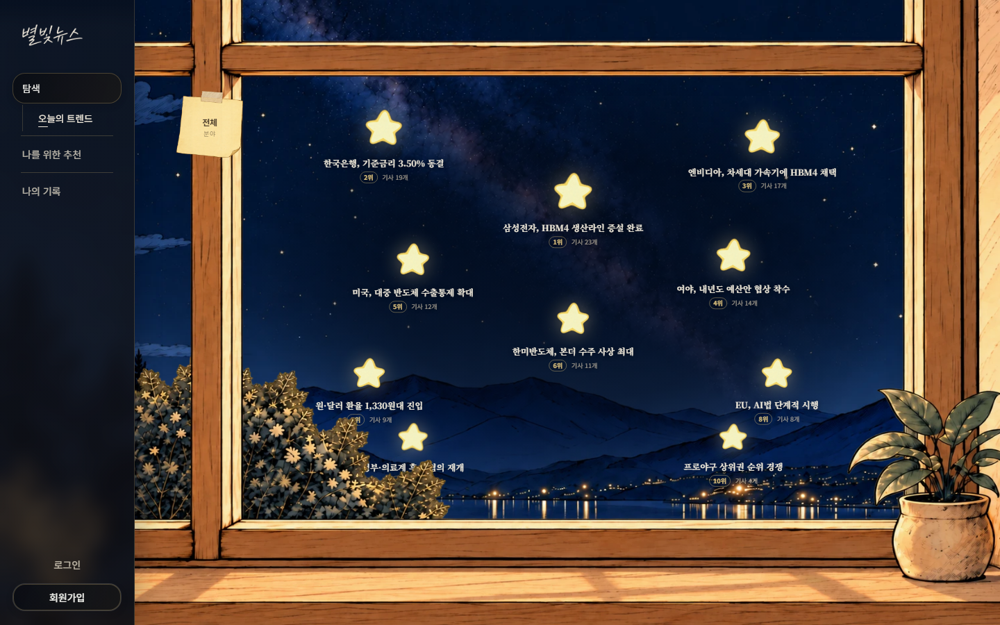

### 2. Event 중심 기사 탐색

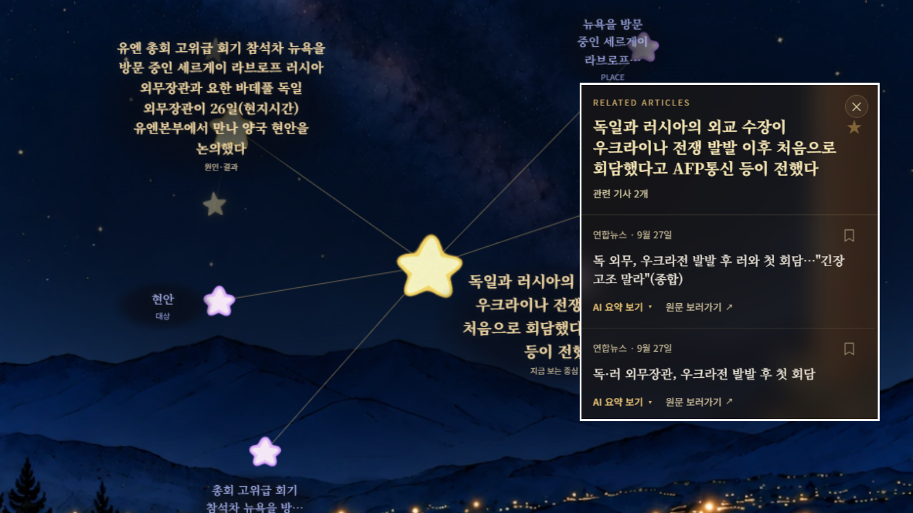

- 한 기사에서 여러 Event를 추출하고, 여러 기사가 동일한 실제 사건을 보도하면 기존 Event로 통합합니다.
- AI 분석 과정에서 기사별 대표 사건을 지정하고(COVERS.isPrimary), 이를 트렌드와 추천의 기준으로 활용합니다.

- KG 추출 결과에 `CAUSES` 관계가 포함되면 사건 사이의 원인·결과를 탐색할 수 있습니다.

### 3. 개인 지식 그래프

- 사용자가 읽은 기사와 직접 탐색한 그래프 Node를 개인 기록에 반영합니다.
- 분야별 Event·Entity·Statement와 이들 사이의 관계를 시각화합니다.
- 마지막으로 읽은 날짜를 기준으로 기간별 개인 그래프와 관련 기사를 조회할 수 있습니다.

### 4. 개인화 뉴스 추천

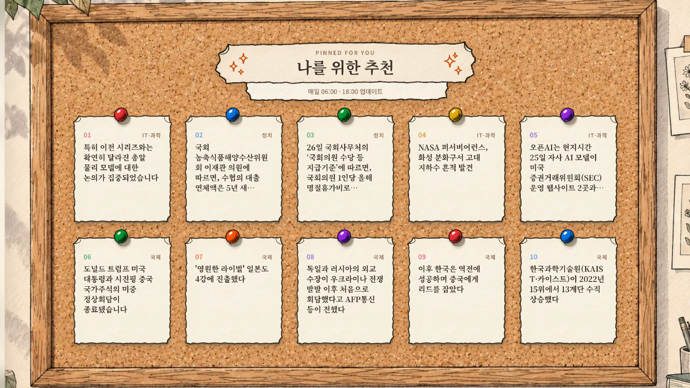

- 읽은 Event의 임베딩으로 사용자 취향 벡터를 구성하는 콘텐츠 기반 필터링을 사용합니다.
- 비슷한 Event를 읽은 사용자의 소비 이력을 활용하는 협업 필터링을 함께 적용합니다.
- 이미 읽은 Event와 비선호 분야를 제외하고 관심 분야와 최근성을 반영합니다.
- 동일 Story에 속한 Event의 반복 노출을 줄이며, 이력이 없는 사용자는 관심 분야의 인기·최신 Event를 추천합니다.

### 5. 검색과 분야별 탐색

- Event·Entity·Statement를 대상으로 키워드 검색을 제공합니다.
- 검색 결과에서 Node 상세, 관련 기사, 주변 그래프로 탐색을 확장할 수 있습니다.
- 정치·경제·사회·문화·국제·스포츠·IT·과학의 7개 분야별 주요 Event를 제공합니다.

### 6. 읽기 기록과 뉴스 리포트

- 사용자가 읽은 전체 기사를 최근 읽은 순으로 조회합니다.
- 최근 3개월의 고유 기사 수와 언론사별 소비 비율을 제공합니다.
- 최근 12주의 분야별 읽기 변화와 사용자가 많이 접한 Entity를 보여줍니다.
- Entity를 처음 접한 시점에 따라 `NEW`와 `FAMILIAR`로 구분합니다.

## 핵심 차별점

### 기사가 아닌 실제 사건을 중심으로 탐색

별빛뉴스의 중심은 Article이 아니라 Event입니다. 하나의 기사에 여러 Event가 포함될 수 있고, 하나의 Event를 여러 기사가 보도할 수 있는 다대다 구조로 뉴스를 구성합니다.

### 관계를 따라 확장되는 뉴스 맥락

Event에서 주체·대상·장소·시점·주장과 다른 Event로 이동하며 기사를 읽기 전에 사건의 구조를 먼저 파악할 수 있습니다. 연결 수가 지나치게 많은 범용 Entity에는 허브 감점을 적용하고, 기사 수와 최신성을 반영해 의미 있는 이웃을 우선 노출합니다.

### Event에서 Story로 이어지는 장기 흐름

Event 임베딩, Topic, 시간 범위와 ACTOR·TARGET 정보를 함께 비교해 관련 Event를 Story로 구성합니다. Story는 트렌드·분야별 탐색·추천에서 같은 흐름의 뉴스가 반복 노출되는 것을 줄이는 데 사용됩니다.

### 사용자의 읽기와 탐색으로 만들어지는 개인 그래프

공용 뉴스 그래프를 그대로 복제하지 않고, 사용자가 읽은 기사와 탐색한 Node만 개인 지식 Node로 축적합니다. 같은 지식 구조 위에서 뉴스 탐색, 개인 기록, 추천과 리포트를 연결합니다.

## 서비스 이용 흐름

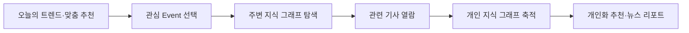

## 시스템 아키텍처

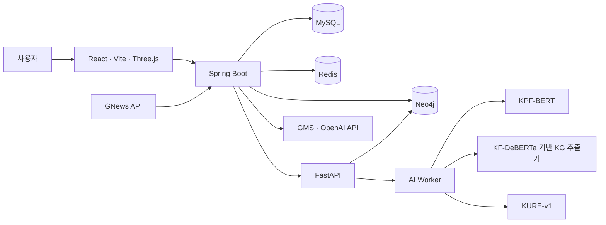

| 구성 요소 | 역할 |
| --- | --- |
| React·Three.js | 서비스 화면과 뉴스·개인 지식 그래프 시각화 |
| Spring Boot | 인증, 기사, 사용자, 검색, 리포트, 배치와 외부 API 연동 |
| FastAPI | 기사 분석 조율, Event 통합, Story 구성, 추천 계산과 Neo4j 적재 |
| AI Worker | 뉴스 분류, 지식 그래프 추출, Event 임베딩 생성 |
| MySQL | 기사, 사용자, 열람 기록, 추천 결과와 개인 지식 Snapshot 저장 |
| Neo4j | 공용 뉴스 지식 그래프와 사용자 행동 그래프 저장 |
| Redis | Refresh Token과 선택적 집계 캐시 저장 |

## 스케줄링과 배치 설계

### 언제 무엇이 실행되는가

트렌드·추천·분야별 탐색은 계산 시각과 사용자에게 공개되는 시각을 분리합니다.

| 작업 | 실행 시각 | 처리 내용 | 반영·공개 시점 |
| --- | --- | --- | --- |
| 뉴스 수집 | 매시 **10분** | GNews 9개 카테고리에서 요청당 최대 12건 수집 | 저장 후 분석 대기 |
| 기사 AI 분석 | 매시 **20분** | 대기 기사 최대 300건을 순차 분석하고 그래프에 적재 | 기사별 분석 완료 후 |
| 사용자 그래프 동기화 | **01:00부터 23:00까지 홀수 시 정각** | 사용자 행동을 추천 계산에 사용하는 그래프로 동기화 | 동기화 완료 후 |
| 오늘의 트렌드 집계 | 매일 **05:00·17:00** | 실행 직전 24시간 기준 주요 Event 집계 | **06:00·18:00** |
| 개인화 추천 생성 | 매일 **05:30·17:30** | 사용자별 추천 계산·저장 및 회차별 요약 생성 | **06:00·18:00** |
| 분야별 탐색 집계 | 매일 **05:50·17:50** | 실행 직전 24시간 기준 Topic별 진입 Node 집계 | **06:00·18:00** |
| 추천 가중치 재튜닝 | 매주 **일요일 03:00** | Holdout 평가로 콘텐츠·협업 추천 가중치 조정 | 이후 추천 회차에서 참조 |

05:00·17:00 사용자 그래프 동기화 결과를 30분 뒤 추천 배치가 읽도록 배치했습니다.
긴 기사 분석이 다른 배치를 모두 지연시키지 않도록 스케줄러 스레드 풀은 **4개**로 설정했습니다.

### CPU 추론에 맞춘 분석 배치

AI Worker는 **한 번에 기사 하나**를 처리합니다. 요청을 동시에 보내면 처리량보다 대기열과 타임아웃이 먼저 늘어날 수 있어, Spring도 기사별 응답을 받은 뒤 다음 기사를 요청합니다.

| 제어 항목 | 기본값 | 설계 이유 |
| --- | --- | --- |
| 회차별 대상 수 | 최대 300건 | 한 회차가 가져오는 작업량 제한 |
| 회차별 시간 예산 | 45분 | 예산이 지나면 새 기사 처리를 시작하지 않고 다음 회차로 넘김 |
| 기사 분석 요청 타임아웃 | 180초 | CPU 추론을 기다리는 전용 호출 설정 |
| 기사별 실패 한도 | 3회 | 반복 실패 기사를 `FAILED`로 전환해 무한 재시도 방지 |
| 연속 실패 한도 | 5건 | 워커 장애 중 남은 기사까지 실패 횟수를 소진하지 않도록 회차 중단 |

시간 예산은 **기사 사이에서 검사**
 이미 진행 중인 추론을 45분에 강제 종료하지는 않으며, 회차마다 완료·제외·재시도·포기·오류 건수와 남은 대기 수, 가장 오래 대기한 시간을 기록해 작업이 없던 회차와 중단된 회차를 구분합니다.

### 오류별 복구 정책

| 발생 상황 | 처리 방식 |
| --- | --- |
| GNews 속도 제한(429) | 기본 1초·2초 대기 후 최대 2회 재시도 |
| 분석할 수 없는 기사 입력 | 해당 기사를 분석 대상에서 제외 |
| 일시적 분석 실패·불완전한 성공 응답 | 실패를 기록하고 한도 내에서 다음 회차에 재시도 |
| 내부 API 인증 오류 | 해당 기사 실패 횟수를 올리지 않고 회차 중단 |
| 연속 분석 실패·시간 예산 소진 | 남은 기사를 다음 회차로 넘김 |
| 기사 그래프 적재 중 실패 | 기사 단위 Neo4j 트랜잭션 전체 롤백 |
| 분석 완료 후 응답 유실·Spring 반영 실패 | 재요청 시 Neo4j의 완료 결과를 조회해 AI 재추론 생략 |
| 추천 청크 계산·저장 실패 | 나머지 청크를 먼저 처리한 뒤 재시도 가능한 청크만 재처리 |
| 트렌드·분야별 집계 실패 | 기본 1분 간격으로 최초 시도 이후 최대 3회 재시도 |

MySQL과 Neo4j를 하나의 분산 트랜잭션으로 묶지는 않습니다. Neo4j에 이미 완료된 결과가 있으면 재요청에서 재사용하고, Spring이 그 결과를 다시 반영하는 방식으로 두 저장소 사이의 실패 구간을 복구합니다.

### 추천 배치의 부분 실패와 회차 일관성

사용자를 **100명 단위 청크**로 나누며, 저장도 청크별 트랜잭션으로 처리합니다. 일시적 통신·서버 오류나 저장 실패는 전체 청크를 한 번 처리한 뒤 **30초 간격, 최초 포함 최대 3회** 시도합니다. 인증·요청 형식 오류처럼 같은 요청을 반복해도 해결되지 않는 오류는 재시도하지 않습니다.

회차 시작 시 공개 시각과 추천 가중치를 한 번 결정해 모든 청크와 재시도가 공유합니다. 따라서 배치 중간에 재튜닝이 완료돼도 같은 회차의 사용자에게 서로 다른 가중치가 적용되지 않습니다. 회차·청크별 실패와 복구 기록을 저장하고, 7일이 지난 추천 회차는 정리합니다.

구현: [실행 설정](backend/spring/src/main/resources/application.properties) · [분석 배치](backend/spring/src/main/java/com/starlightnews/backend/domain/article/analysis/ArticleAnalysisBatchService.java) · [추천 배치](backend/spring/src/main/java/com/starlightnews/backend/domain/recommendation/service/RecommendationBatchService.java)

## 데이터 및 AI 처리 과정

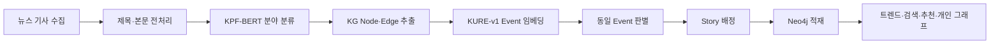

### 모델 구성과 공개 모델

지식 그래프 추출 모델은 **[sysy9292/kf-deberta-base-kg-extractor](https://huggingface.co/sysy9292/kf-deberta-base-kg-extractor)**에 공개되어 있습니다. KF-DeBERTa를 기반으로 기사 한 건에서 의미 노드와 관계를 추출하는 ArticleLocal KG 런타임 패키지입니다.

| 구성 | 모델·구현 | 출력과 역할 |
| --- | --- | --- |
| 뉴스 분류 | `KPF/KPF-bert-cls1/2/3`, `jinmang2/kpfbert` 토크나이저 | 대분류·소분류·지역 및 서비스 Topic |
| 지식 그래프 추출 | `kakaobank/kf-deberta-base` 기반 ArticleLocal KG | 기사 내부 Event·Entity·Statement·Time과 관계 |
| 사건 임베딩 | `nlpai-lab/KURE-v1` | 정규화한 1024차원 Event 벡터 |
| 서비스 변환 | `adapt_to_schema` | 모델 PUBLIC JSON을 서비스용 Node·Edge 형식으로 변환 |
| 기사 간 통합 | FastAPI의 Event·Story 처리 | 여러 기사에서 나온 그래프를 공용 그래프로 연결 |

### 공개 릴리스와 연구 모델의 버전

공개·서비스에 적용한 모델과 후속 연구 버전을 다음과 같이 구분합니다. 최신 연구 상태는 **2026-09-28 확인한 GitLab `dev`의 `c71a154`** 기준이며, 아래 링크는 해당 커밋으로 고정했습니다. README 브랜치의 이전 연구 사본과 최신 기록에 차이가 있어 최신 학습 상태는 이 근거를 따릅니다.

| 버전 | 학습·배포 상태 | 설명 |
| --- | --- | --- |
| **v2.3** | Gold380 기반 학습·검증 완료 | v3 이전의 공개 릴리스 |
| **v3.0 서비스 버전** | 6단계 학습 후 Hugging Face 공개·서비스 배포 완료 | 현재 서비스에서 사용하는 KG 추출 모델 |
| **v3.1 후속 버전** | Gold100 리허설 완료, Gold900 본학습 준비 | Trigger·Participant 최종 판정과 Entity 통합 구조를 개선 |

각 epoch·step은 표에 명시한 **선택 Phase 체크포인트의 기록**이며 전체 학습의 누적 횟수가 아닙니다. v3 학습 문서의 `execution-state.json`은 이전 16단계 사전 계획 기록이므로 이후 본학습 여부는 릴리스 manifest의 `training_provenance`로 확인합니다. 서비스 로더는 **v3 프로젝트 번들 → v2.3 BoundedCandidate → 기존 pipeline 설정** 순으로 구조를 판별하지만, 이 지원 코드만으로 실제 서버에 마운트된 모델 버전을 확정하지는 않습니다.

근거: [연구 색인][ai-index] · [v3.0 번들][ai-v3] · [v3 학습 기록 안내][ai-training] · [v3.1 리허설 보고서][ai-v31-report]

### 모델 내부 구조와 설계 근거

KG 추출기는 사전학습 backbone의 문맥 표현 위에 **구간 추출, 역할 연결, 개체·사건 동일성, 최종 관계 판정**을 수행하는 학습 모듈을 올린 구조입니다. 기사 내부의 동일성 판단은 모델 런타임에서 수행하고, 서로 다른 기사 사이의 Event 통합은 뒤에서 설명하는 KURE 임베딩·FastAPI 로직이 담당합니다.

| 설계 지점 | 구현·선택 | 해결하려는 문제 |
| --- | --- | --- |
| Backbone 표현 | 고정 KF-DeBERTa의 L8/L10/L12와 작업별 표현 경로 사용. v3 core는 768차원 입력·256차원 문맥 표현 계약 | 마지막 layer 하나가 모든 추출 작업에 최적이라는 가정 제거 |
| 공유 문맥 | DocumentContextEncoder(DCE)와 구간 표현을 작업 모듈이 공유 | 작업마다 기사 문맥을 독립적으로 만드는 중복 감소 |
| 의미와 경계 판정 | Canonical Span 표현 위에서 semantic eligibility와 boundary exactness의 감독·출력·판정을 분리 | 의미가 맞는 구간과 시작·끝 경계가 정확한 구간을 하나의 점수로 혼동하는 문제 제어 |
| 후보 제안과 최종 수락 | v3.1 Trigger·Participant는 endpoint로 후보를 좁힌 뒤 exact span head로 최종 순위·수락 결정 | 저렴한 경계 점수를 최종 의미 판정으로 사용하는 문제 개선 |
| 개체 동일성 | Native Entity와 Participant 역할에서 얻은 mention을 하나의 coreference 경로로 통합 | 같은 개체를 추출 경로별로 중복 생성하거나 역할 근거를 잃는 문제 제어 |
| 사건 동일성과 후속 관계 | Entity·역할·시간 정보를 구성한 뒤 Event identity를 판단하고, 닫힌 Event cluster를 ABOUT·CAUSES·Primary가 사용 | 후속 관계가 아직 정리되지 않은 개체·사건 구조를 참조하는 문제 제어 |
| 서비스 출력 | Primary 점수를 바탕으로 주요 Event·Statement를 선택하고 서비스에 필요한 Node·Edge만 출력 | 내부 후보와 중복 표현이 서비스 그래프에 그대로 노출되는 문제 방지 |

**Backbone 선택도 실험을 거쳤습니다.** 같은 데이터 분할·초기화 조건에서 문맥 모듈과 head를 다시 학습한 초기 비교의 token/span 4개 작업 평균 test macro-F1은 legacy L12 **0.5496**, KF L10 **0.8260**, KF L12 **0.8229**였습니다. 반면 sentence routing은 legacy가 더 높았고 Entity exact span은 KF L12가 유리했습니다. 따라서 ‘KF-DeBERTa 최종 layer로 전부 교체’ 대신 작업별 layer 선택을 설계 근거로 삼았습니다. 이 수치는 초기 구성요소 비교이며 최종 KG 전체 성능이 아닙니다. [백본·head 재학습 실험](ai_research/docs/00-origin/direction-test/Report-KF-L10-L12-Cache-Head-Retraining-v1/Report-KF-L10-L12-Cache-Head-Retraining-v1.md)

**의미 판정과 경계 판정의 책임도 분리했습니다.** 앞선 실험에서는 하나의 verifier에 의미 유효성과 구간 범위 학습을 함께 맡길 때 점수 보정이 흔들렸습니다. 후속 Canonical Span 설계는 시작·끝·내용 attention·폭 임베딩을 공유 구간 표현으로 만들고 두 개의 독립 head가 판단하도록 정리했습니다. 경계가 조금 틀렸다는 이유만으로 의미적으로 잘못된 음성 예제로 취급하지 않습니다. 해당 구조의 **760,226개 파라미터는 semantic 모듈 크기이며 전체 KG 모델 크기가 아닙니다.** [책임 분리 연구](ai_research/docs/30-semantic/v3-semantic-responsibility-split-architecture-v2/report.md) · [Canonical Span 구조](ai_research/docs/30-semantic/v3-canonical-span-representation-architecture-v1/report.md)

Event와 Statement의 원문 span은 근거로 보존하고, 화면에 보여주는 문장은 원문의 의미를 유지하는 범위에서 읽기 쉽게 정리합니다.

Time은 원문 표현을 정규화하고 Event와의 연결을 확인한 뒤 `OCCURRED_ON`으로 출력하며, 정확한 시점으로 해석하기 어려운 표현은 서비스 그래프에서 제외합니다.

### 의존성을 따라 나눈 6단계 학습

최신 학습 경로는 모든 head를 한꺼번에 학습하는 구성에서 **앞 단계의 구조를 뒤 단계가 사용하는 순서**로 나뉩니다. v3.1 Gold100 리허설 보고서에 기록된 단계는 다음과 같습니다.

| 단계 | 학습 내용 | 다음 단계로 연결되는 정보 |
| --- | --- | --- |
| P1 · Extraction | Event·Statement와 Trigger·Participant·Entity·Time 추출 | 원문에 연결된 의미 구간 |
| P2 · Sources | Event-Time 연결·시간 정규화·발화자 후보 추출 | 시간과 발화자 근거 |
| P3 · Entity Identity | 같은 개체를 가리키는 mention 통합 | 통합된 Entity |
| P4 · Attribution | Statement의 발화자를 통합 Entity와 연결 | ASSERTED_BY 관계 |
| P5 · Event Identity | 같은 사건을 가리키는 Event 통합 | Event cluster |
| P6 · Cluster Consumers | ABOUT·CAUSES·Primary 판정 | 최종 관계와 주요 사건 |

v3.1은 train73으로 학습하고 dev15에서 체크포인트와 임계값을 선정했으며, 학습·선정·보정 중 test12 접근은 0으로 기록돼 있습니다. P6는 train loss가 줄어도 dev 선택 지표가 epoch 1 이후 하락해 **epoch 1**을 선택했습니다. 학습이 실행됐다는 사실, 구성요소 지표, 실제 예측 그래프 품질을 구분해 기록합니다. [v3.1 학습·선정 근거][ai-v31-report]

### v3.1의 최종 결정 공식과 출력 제어

Trigger와 Participant의 endpoint 점수는 후보 제안·초기 gate에만 사용합니다. 최종 수락은 별도 exact span 점수에 임계값을 적용하며 두 점수를 합산하지 않습니다.

$$
\operatorname{accept}_{trigger}(x)=[s_{trigger\_span}(x)\geq\tau_{trigger}],\qquad
\operatorname{accept}_{participant}(x)=[s_{participant\_span}(x)\geq\tau_{participant}]
$$

Entity pair는 학습과 추론이 같은 대칭 feature 생성 함수를 사용합니다. 좌우 표현의 합·절댓값 차이·원소별 곱과 문서 표현·원문 기반 특성을 입력하고, 두 출력 logit의 차이로 병합을 결정합니다.

$$
\operatorname{merge}(a,b)=
[\ell_{MERGE}(a,b)-\ell_{KEEP}(a,b)\geq m]
$$

| 결정 | 선택된 Gold100 P6의 값 | 주의할 척도 |
| --- | ---: | --- |
| Trigger 최종 수락 | 1.403719 | exact span raw logit |
| Participant 최종 수락 | 0.087154 | exact span raw logit |
| Entity 병합 | -1.112733 | MERGE−KEEP logit margin |

위 값은 **해당 체크포인트에 결합된 값**으로, 확률이나 다른 버전에 공통으로 적용할 기본값이 아닙니다. Entity margin의 명시적 보정 근거는 MERGE 81쌍·KEEP 9쌍으로 제한돼 잠정 선정으로 기록됐습니다.

후보 라우팅에서 선택되지 않은 pair는 음성이 아니라 `NOT_EVALUATED`로 취급합니다. 동일성은 complete-link 방식으로 닫으며, Participant에서 얻은 `ROLE_ONLY` mention은 기존 Entity와 병합되지 않아도 독립 Entity로 남을 수 있습니다. 이후 PUBLIC 출력에서 역할 관계를 endpoint별로 정리하고 confidence 순으로 Event당 **ACTOR 2개·TARGET 2개·PLACE 1개**까지 표시합니다. 추론 후보 예산과 화면에 내보내는 관계 수 제한은 서로 다른 단계입니다. [최신 head 계약][ai-v31-head] · [통합 Entity 설계][ai-v31-entity] · [체크포인트별 보정 결과][ai-v31-report]

### 추론 비용을 줄인 과정과 검증 범위

| 문제 | 채택한 접근 | 검증·절충 |
| --- | --- | --- |
| 학습·평가에서 같은 frozen backbone 반복 실행 | 같은 run의 동일 source view에 대해 detached FP32 CPU L8/L10/L12 캐시 재사용 | 학습되는 DCE와 task 표현은 매 optimizer step 다시 계산. cache key에 본문·토크나이저·backbone revision·실제 입력과 offset까지 결합 |
| 긴 기사에서 Entity·Time·pair 후보 폭증 | 후보 라우팅·계산 예산, 청크 실행, 필요한 표현의 재사용 | 상한 도달 시 일부 후보가 빠질 수 있으므로 계산 재사용과 후보 정책 변경을 구분 |
| 출력에 쓰이지 않는 반복 계산 | 역할에서 참조하는 Entity 표현, P5 Event 표현 등을 필요한 후속 단계에서 재사용 | 단일 fixture의 동일 출력 검증을 전체 기사 성능 향상으로 확대 해석하지 않음 |

**비용이 줄어도 정답이 사라지는 최적화는 기각했습니다.** 과거 Event×role K2 실험은 role 후보를 **593,941 → 1,625**로 줄였지만 Gold Participant 포착도 **60/142 → 12/142**로 떨어져 채택하지 않았습니다. 이는 현재 PUBLIC 역할 표시 상한과 다른, 추론 중간 후보를 줄이는 과거 실험입니다. [최적화 채택·기각 기록][ai-optimization] · [frozen feature 캐시 설계][ai-cache]

| 실험 | 보고된 결과 | 해석 범위 |
| --- | --- | --- |
| Gold 95 → 380 확대 | 고정 Holdout50 외부 exact F1 **0.092346 → 0.139691** | 같은 DEV39·평가축의 scaling 실험. semantic 안정성 기준은 D380에서 seed 1/3만 통과 |
| v2.3 CPU 검증 | 측정 70건 평균 **3.535초**, P95 **6.836초**, 장문 최대 **87.223초** | CPU·FP32·4 threads·상주 worker. 첫 실행·warm-up을 평균/P95에서 제외한 KG 런타임 측정이며 전체 서비스 처리 시간과 다름 |
| v2.3 출력 구조 | 고정 72건의 grounding·endpoint 검증 72/72 통과 | 구조 검증이며 추출 내용이 모두 정답이라는 뜻은 아님 |
| v3.1 Gold100 리허설 | P1 Trigger raw-score AP **0.2869 → 0.4411**, Participant macro AP **0.6446 → 0.7402** | P1 epoch 1→3 구성요소 지표. v3.0 대비 전체 그래프 품질·지연 개선 증거로 사용하지 않음 |

근거: [Gold scaling 보고서](ai_research/docs/70-gold-scaling/v3-frozen-gold-scaling-study-v1/fixed-dev39-final-unblock/report.md) · [v2.3 최종 검증](ai_research/docs/95-release-v23/release-v23/final-validation-summary.md) · [공개 모델의 CPU 측정 조건](https://huggingface.co/sysy9292/kf-deberta-base-kg-extractor) · [v3.1 검증 범위][ai-v31-report]

[ai-index]: https://lab.ssafy.com/s15-bigdata-recom-sub1/S15P21E206/-/blob/c71a15472afbe41cebe8689f593d3b0605abb2b6/ai_research/docs/INDEX.md
[ai-v3]: https://lab.ssafy.com/s15-bigdata-recom-sub1/S15P21E206/-/blob/c71a15472afbe41cebe8689f593d3b0605abb2b6/ai_research/baseline/v3/README.md
[ai-training]: https://lab.ssafy.com/s15-bigdata-recom-sub1/S15P21E206/-/blob/c71a15472afbe41cebe8689f593d3b0605abb2b6/ai_research/training/v3/README.md
[ai-v31-report]: https://lab.ssafy.com/s15-bigdata-recom-sub1/S15P21E206/-/blob/c71a15472afbe41cebe8689f593d3b0605abb2b6/ai_research/docs/10-baseline/v31-gold100-p6-baseline-v1/report.md
[ai-v31-head]: https://lab.ssafy.com/s15-bigdata-recom-sub1/S15P21E206/-/blob/c71a15472afbe41cebe8689f593d3b0605abb2b6/ai_research/training/v3.1/docs/v31-trigger-entity-head-contract.md
[ai-v31-entity]: https://lab.ssafy.com/s15-bigdata-recom-sub1/S15P21E206/-/blob/c71a15472afbe41cebe8689f593d3b0605abb2b6/ai_research/training/v3.1/docs/unified-entity-identity-v1.md
[ai-optimization]: https://lab.ssafy.com/s15-bigdata-recom-sub1/S15P21E206/-/blob/c71a15472afbe41cebe8689f593d3b0605abb2b6/ai_research/training/v3/docs/optimization-history.md
[ai-cache]: https://lab.ssafy.com/s15-bigdata-recom-sub1/S15P21E206/-/blob/c71a15472afbe41cebe8689f593d3b0605abb2b6/ai_research/training/v3/docs/v3-frozen-feature-cache.md

### 서비스 AI 파이프라인

앞의 모델 연구·학습 결과를 서비스에서는 다음 단계로 연결합니다. 아래 구현 설명은 현재 README 브랜치의 `ai/`와 FastAPI 코드 기준입니다.

#### 1. 본문 정제와 긴 기사 분류

본문을 줄 단위로 정리하고 중복 문단·이모지·장식 기호를 제거합니다. 기본 10자 미만, 이메일 기호가 포함된 줄, 문장 종결 형태가 없는 줄을 걸러내며, 유효한 본문이 남지 않으면 분석 입력을 거부합니다.

분류기는 긴 기사를 **최대 512토큰, 128토큰 중첩**의 창으로 나눕니다. 각 창의 softmax 확률을 평균해 기사 전체의 분류 점수를 계산하므로 기사 앞부분만으로 분야를 결정하지 않습니다.

$$
P(c\mid article)=\frac{1}{W}\sum_{j=1}^{W}\operatorname{softmax}(z_j)_c
$$

여기서 $W$는 창 개수, $z_j$는 해당 창의 분류 logits입니다. 대분류 상위 결과를 선택한 뒤, 소분류 상위 3개 중 그 대분류에 속하는 항목을 선택합니다. 적합한 소분류가 없으면 해당 대분류의 일반 항목을 사용합니다.

#### 2. 기사 내부 그래프 추출과 서비스 스키마 변환

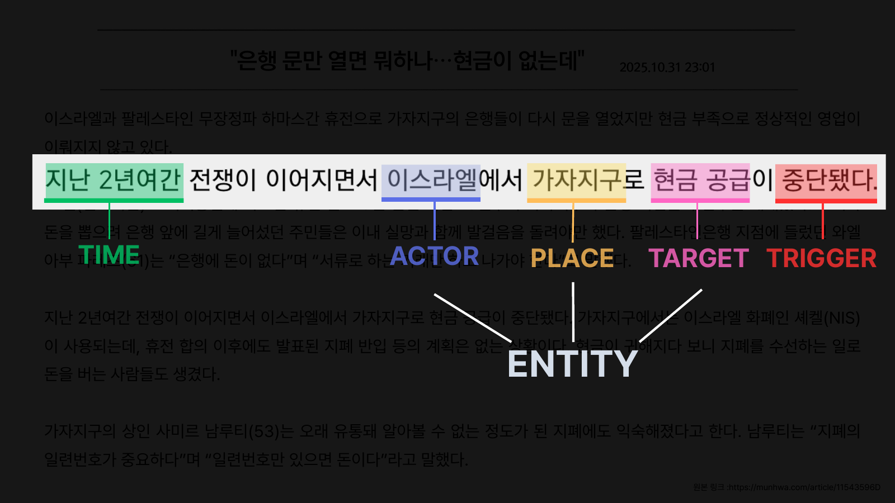

KG 추출기는 기사 ID·본문·제목·발행 시각을 받아 PUBLIC JSON을 반환합니다. 공개 v3.0 런타임은 Participant→Entity, Event→Time, Event 쌍의 후보 범위를 제한하고 필요한 backbone layer(L8/L10/L12)를 선택적으로 유지하는 방식으로 추론 작업량을 제어합니다. 세부 검증 범위는 [공개 모델 카드](https://huggingface.co/sysy9292/kf-deberta-base-kg-extractor)를 참고할 수 있습니다.

서비스 어댑터는 추출 결과를 그대로 DB에 쓰지 않고 다음 규칙으로 변환합니다.

- 기사 내부 언급 계층인 `LOCAL_EVENT`를 제외하고 공개 `EVENT`만 서비스 Event로 사용합니다.
- 노드 유형별로 표시 텍스트·개체 유형·시간 키를 서비스 속성에 맞춥니다.
- 지원하는 관계 유형만 전달하고, 모델의 `confidence` 등 관계 속성을 변환합니다.
- v3의 주요 Event 판정이 전달되면 활용하고, 판정이 없으면 FastAPI에서 실제 Event UUID 정렬 기준으로 대표 Event 하나를 선택합니다.

KG 추출은 **기사 내부 구조**, FastAPI는 **기사 간 동일 사건 판별과 공용 그래프 통합**을 담당합니다. 모델 출력의 임시 ID는 적재 과정에서 실제 Neo4j ID로 매핑합니다.

#### 3. 사건 임베딩과 동일 Event 판별

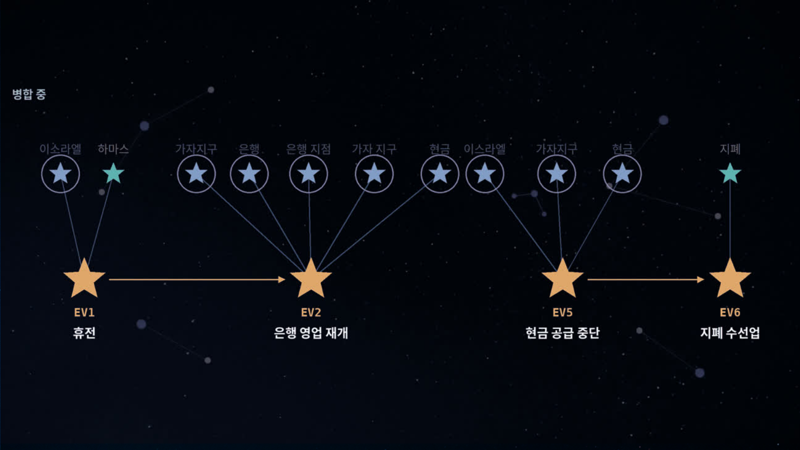

공개 `EVENT` 노드의 대표 텍스트를 KURE-v1으로 임베딩합니다. 기존 Event의 벡터 검색 상위 **8개** 중 검색 점수 **0.92 이상**인 후보를 확인하고, ACTOR·TARGET 신호가 명확히 다른 사건을 가리키면 병합하지 않습니다.

코드에서 사용하는 Neo4j 벡터 검색 점수와 직접 계산한 코사인 유사도의 척도를 맞춥니다.

$$
s=\frac{1+\cos(\mathbf{e}_1,\mathbf{e}_2)}{2},\qquad
s\geq0.92\iff\cos(\mathbf{e}_1,\mathbf{e}_2)\geq0.84
$$

벡터 인덱스에서 보이지 않는 **같은 트랜잭션 안의 새 Event**도 메모리 후보 목록에서 직접 비교합니다. 이를 통해 한 기사 안에서 이미 생성한 사건을 다시 만드는 경우를 제어합니다. 동일 사건이면 기존 Event를 재사용하고 새 표현을 별칭에 추가하며, 대표 벡터를 새 벡터 비중 **0.15**의 지수이동평균으로 갱신한 뒤 정규화합니다.

#### 4. 관련 사건을 Story로 연결

동일 사건의 통합과 관련 사건의 묶음을 분리합니다. 새로운 Event는 **동일 Topic, 최근 30일 이내의 흐름**에서 벡터 점수 **0.8 이상**의 Story·독립 Event 후보를 검토합니다. Story는 최근 구성 Event 최대 3개의 ACTOR·TARGET 신호로 충돌 여부를 확인합니다. 유효한 Story 후보가 독립 Event 후보보다 점수가 높거나 같으면 기존 Story에 편입하고, 독립 Event 후보가 더 적합하면 두 Event를 새 Story로 묶습니다. 둘 다 없으면 독립 상태로 유지합니다.

#### 5. 원자적 적재와 상주 추론 Worker

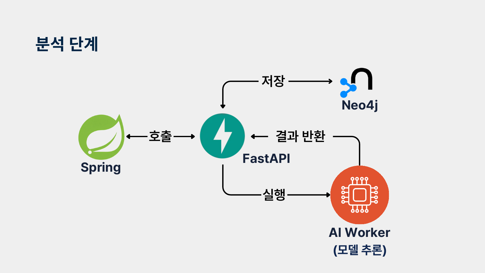

FastAPI는 AI 응답의 분류·Node·Edge 기본 구조를 검사한 뒤 **Article → Time·Entity → Event → Statement → 관계** 순서로 반영합니다. 이 과정은 기사 단위 Neo4j 트랜잭션으로 묶어 중간 실패 시 부분 그래프가 남지 않도록 합니다.

모델은 요청마다 로드하지 않습니다. AI Worker 시작 시 `ArticleAnalyzer`에 분류기·KG 추출기·임베딩 모델을 준비하고 같은 인스턴스를 재사용합니다. 준비가 끝나야 `/ready`가 성공하며, 추론은 Lock으로 직렬화해 동시 모델 접근과 메모리 급증을 제어합니다.

**코드는 Git, 실행 환경은 Docker 이미지, 모델은 외부 Volume**으로 분리했습니다. FastAPI는 워커를 내부 HTTP로 호출하므로 일반 앱 배포와 모델 프로세스의 수명을 분리할 수 있습니다.

구현: [AI 파이프라인](ai/starlight_ai/pipeline.py) · [KG 로더](ai/starlight_ai/models/kg_extractor.py) · [스키마 변환](ai/starlight_ai/adapter/neo4j_schema.py) · [그래프 적재](backend/fastapi/app/articles/service.py) · [AI 운영 환경](ai/README.md)

## 지식 그래프 모델

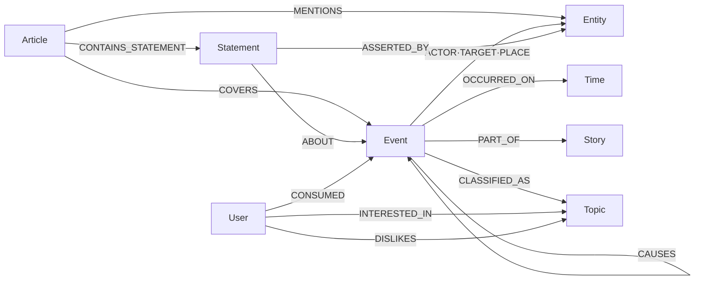

### 주요 Node

| Node | 설명 |
| --- | --- |
| Article | 수집한 뉴스 기사 |
| Event | 기사에서 추출해 실제 사건 단위로 통합한 Node |
| Story | 의미적으로 관련된 Event의 장기 흐름 |
| Entity | 인물·기업·기관·장소·제품 등의 개체 |
| Statement | 기사에 포함된 주장·전망·평가 |
| Time | Event의 발생 시점 |
| Topic | 서비스에서 사용하는 7개 뉴스 분야 |

## 주변 노드 탐색과 점수 설계

주변 노드는 연결 거리만으로 정렬하지 않습니다. 뉴스 그래프에서는 ‘미국’·‘한국’처럼 연결이 많은 Entity를 거치면 서로 관련이 약한 사건까지 상위에 나타날 수 있습니다. **경로의 신뢰도·거리·허브 여부·기사 수·최신성**을 함께 반영합니다.

### 경로 점수와 최종 순위

중심 노드 $c$에서 후보 $n$까지 허용된 경로 집합을 $P(c,n)$이라 할 때, 각 경로의 관계 신뢰도와 종류별 가중치를 곱하고 Hop 수로 나눕니다. 여러 경로 중 가장 높은 점수를 사용합니다.

$$
B(n)=\max_{p\in P(c,n)}\frac{\prod_{r\in p}(\operatorname{confidence}(r)\cdot w_r)}{|p|}
$$

$$
S(n)=\frac{B(n)}{1+\ln\left(1+\frac{\max(d_n-h,0)}{h}\right)}
\cdot(1+\alpha\ln(1+A_n))\cdot2^{-\Delta t_n/T}
$$

| 요소 | 의미·기본값 | 반영 의도 |
| --- | --- | --- |
| `confidence` | 관계 신뢰도, 누락 시 0.5 | 추출된 관계의 신뢰도 반영 |
| $w_r$ | `PLACE` 0.6, `OCCURRED_ON` 0.3, 그 외 1.0 | 장소·시점만 공유하는 연결의 영향 완화 |
| Hop 수 | 경로 길이 | 멀리 떨어진 노드 감점 |
| $d_n$, $h$ | 노드 연결 수, 허브 기준 50 | 기준을 넘는 연결 수에만 로그 감점 적용 |
| $A_n$, $\alpha$ | 연결된 기사 수, 보정 계수 0.1 | 더 많은 기사에서 다룬 노드에 가점 |
| $\Delta t_n$, $T$ | 최신 관련 기사 이후 경과일, 반감기 7일 | 오래된 정보를 완만하게 감점 |

최신 기사 시각을 알 수 없으면 최신성 감점을 하지 않고, 미래 시각은 경과일 0으로 처리합니다. 허브는 결과에 남길 수 있지만 **연결 수 300 초과 노드는 중간 경유지로 사용하지 않습니다.** 점수 감점과 경로 확장 제한을 함께 적용합니다.

### 응답 크기와 연결 구조 제어

탐색 깊이는 **1~3 Hop**으로 제한하고, 경로의 중간·도착 노드를 Event·Entity·Statement·Time으로 한정합니다. 점수 내림차순, 노드 유형·ID 오름차순으로 정렬하고 이 정렬 키를 커서에 담습니다. 관계는 **중심 노드와 현재 응답 노드 집합 사이**에서만 조회해 화면에 없는 노드를 향하는 Edge가 응답에 섞이지 않도록 합니다.

구현: [주변 노드 점수 쿼리](backend/spring/src/main/java/com/starlightnews/backend/domain/graph/repository/Neo4jGraphNeighborRepository.java) · [조회·페이지 처리](backend/spring/src/main/java/com/starlightnews/backend/domain/graph/service/GraphNeighborService.java)

## 개인화 추천과 평가 설계

추천은 **후보 필터 → 콘텐츠·협업 점수 계산 → 가중합 → Story 중복 제어 → 상위 10개 저장**으로 구성합니다. 적어도 한 기사에서 주요 사건으로 지정된 `PrimaryEvent`를 추천 후보로 사용합니다.

### 1. 읽기 기록을 사용자 취향 벡터로 변환

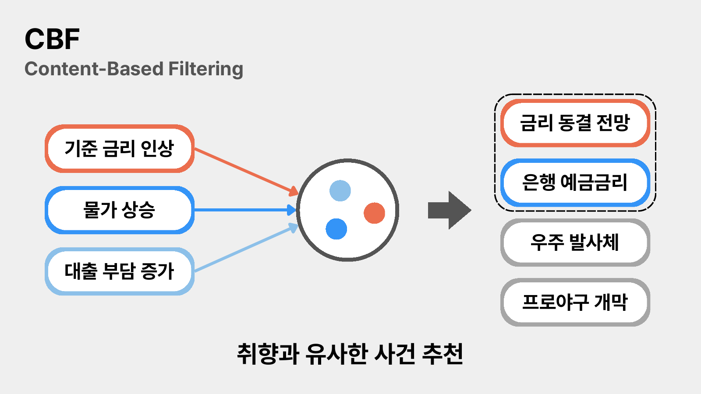

읽은 Event마다 클릭 수·마지막 열람 시각·즐겨찾기 여부로 가중치를 계산합니다. 클릭 수는 로그로 완화하고, 최근성은 반감기 14일로 감쇠합니다. 즐겨찾기한 Event에는 2배 가중치를 적용합니다.

$$
w_i=\ln(1+\mathrm{clicks}_i)\cdot2^{-\Delta t_i/14}\cdot f_i,
\qquad f_i=\begin{cases}2&\text{즐겨찾기}\\1&\text{그 외}\end{cases}
$$

$$
\mathbf{u}=\frac{\sum_i w_i\mathbf{e}_i}{\sum_i w_i}
$$

$\mathbf{e}_i$는 읽은 Event 임베딩, $\mathbf{u}$는 사용자 취향 벡터입니다. 이 벡터로 `PrimaryEvent` 벡터 인덱스를 검색해 콘텐츠 점수 $S_{CBF}$를 얻습니다. 이력이 있어도 유효한 임베딩이나 가중치가 없으면 콘텐츠 후보는 빈 결과로 처리합니다.

### 2. 공통 소비 이력으로 협업 점수 계산

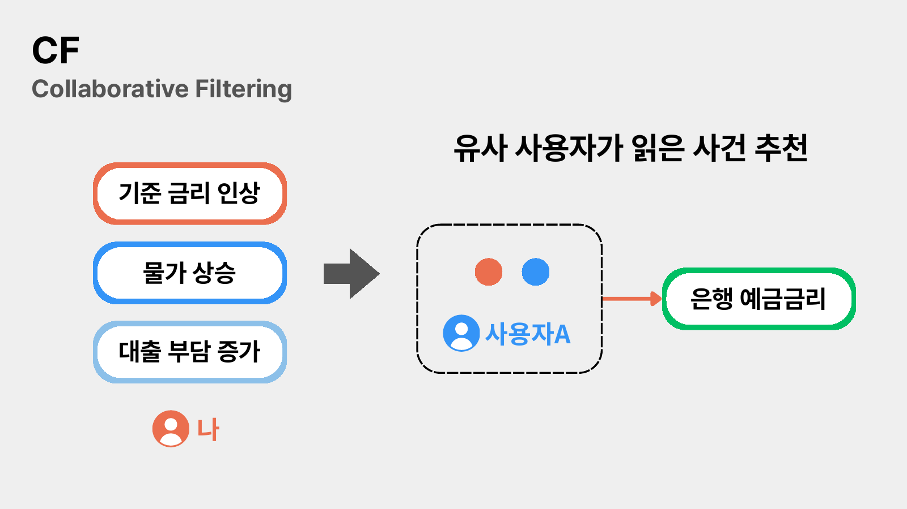

사용자별로 읽은 Event 집합 $E_u$, $E_v$의 **Jaccard 유사도**를 계산하고, 유사한 사용자 상위 50명을 선택합니다.

$$
J(u,v)=\frac{|E_u\cap E_v|}{|E_u\cup E_v|},\qquad
C(u,e)=\sum_{v\in N_{50}(u),\ e\in E_v}J(u,v)
$$

후보 Event를 읽은 유사 사용자들의 유사도를 합산한 뒤, 후보 중 최대 점수로 나눠 $S_{CF}$를 0~1로 정규화합니다. 최대 점수가 0 이하면 협업 점수도 0으로 처리합니다.

### 3. 후보 필터와 최종 추천

| 단계 | 적용 규칙 |
| --- | --- |
| 일반 추천 공통 필터 | 이미 읽은 Event·비선호 Topic 제외, 관심 Topic이 있으면 해당 분야로 제한, 최근 15일 사건만 허용 |
| 콘텐츠 후보 확보 | 목표 20개. 최초 60개 벡터 검색 후 필터 통과분이 부족하면 120 → 240 → 480 → 최대 500개로 확대 |
| 점수 결합 | 콘텐츠·협업 후보의 합집합을 사용하고, 한쪽에 없는 후보 점수는 0으로 처리 |
| Story 중복 제어 | 같은 Story에서는 최고 점수 Event만 유지. 제거 후 10개 미만이면 제거 전 후보 사용 |
| 최종 결과 | 점수순 상위 10개 선택 |

$$
S_{final}(u,e)=\alpha S_{CBF}(u,e)+\beta S_{CF}(u,e),
\qquad (\alpha,\beta)_{initial}=(0.7,0.3)
$$

초기에는 사용자 이력이 적어 협업 추천 후보가 부족할 수 있으므로 콘텐츠 점수 비중을 높여 시작합니다. 후보 수를 늘리는 조회도 상한을 두며, Story 다양성과 결과 수 사이의 절충을 명시적으로 처리합니다.

### 4. 신규 사용자 추천

소비 이력이 없는 사용자는 관심 Topic 안에서 인기도를 계산하며, 관심 Topic이 없으면 전체 분야를 대상으로 합니다. 고유 소비자 수 $U_e$와 사건 발생 후 경과일 $\Delta t_e$를 사용합니다.

$$
S_{cold}(e)=\ln(1+U_e)\cdot2^{-\Delta t_e/3}
$$

인기 점수의 반감기는 **3일**입니다. Story 중복 제어 후 상위 10개를 선택합니다. 이 경로는 일반 추천의 15일 후보 필터와 별도로 조회하며, 최근성을 점수 감쇠로 반영합니다.

최근성 계산에는 DB의 `occurredAt`을 사용합니다. 현재 온라인 적재에서는 이 값을 기사 발행 시각으로 설정하므로, 본문에서 추출한 실제 사건 발생 시각과는 구분됩니다.

### 5. 주간 평가와 가중치 재튜닝

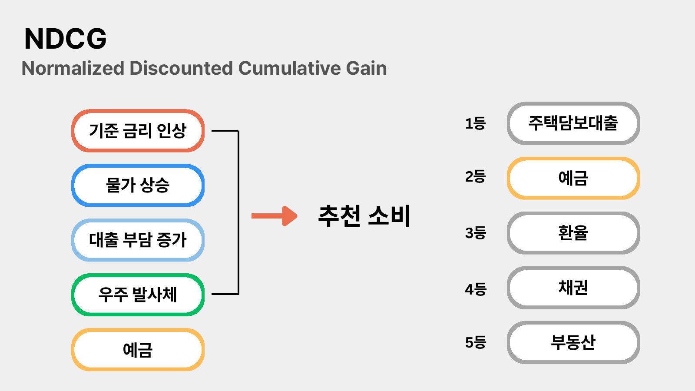

1. 사용자 이력 중 추천의 최근성 조건을 만족하는 항목에서 가장 최근 **20%**를 정답으로 분리합니다. 정답과 남은 이력이 모두 있는 사용자만 평가합니다.
2. 평가 트랜잭션 안에서 정답 Event의 `CONSUMED` 관계를 일시적으로 제거하고 추천을 계산합니다. 종료 시 롤백해 소비 이력을 복원합니다.
3. $(\alpha,\beta)$의 합을 1로 고정하고 **0.1 간격의 11개 조합**을 비교합니다.
4. 사용자 평균 **NDCG@10**이 가장 높은 조합을 선택하고, HitRate@10·Recall@10을 함께 기록합니다.

| 지표·제어 | 의미 |
| --- | --- |
| NDCG@10 | 정답을 앞 순위에 추천했는지 평가. 정답 순위 $r$에 $1/\log_2(r+1)$을 부여하고 이상적 순위 점수로 정규화 |
| HitRate@10 | 상위 10개에 정답이 하나라도 포함된 사용자 비율 |
| Recall@10 | 숨긴 정답 중 상위 10개에서 찾아낸 비율의 사용자 평균 |
| 급격한 가중치 변경 제한 | 직전 값이 있으면 콘텐츠 가중치 변화가 ±0.1 이내인 조합에서 선택 |
| 동점·평가 불가 | 동점은 직전 값에 가까운 조합 선택. 평가 가능한 사용자가 없거나 모두 실패하면 직전 값 또는 초기값 유지 |

위 내용은 구현된 평가 절차이며, 실측 추천 성능 수치를 의미하지 않습니다.

구현: [추천 점수·평가](backend/fastapi/app/recommendations/service.py) · [후보 조회](backend/fastapi/app/recommendations/repository.py)

## 기술 스택

| 구분 | 기술 |
| --- | --- |
| Frontend | React 19, React Router 7, Three.js, Vite 8 |
| Backend | Java 21, Spring Boot 3.4, Spring Security, Spring Data JPA·Neo4j·Redis |
| AI·Graph API | Python, FastAPI, Transformers, Sentence Transformers |
| Database | MySQL 8.4, Neo4j 5.26, Redis 7 |
| AI Model | KPF-BERT, [KF-DeBERTa 기반 KG 추출기](https://huggingface.co/sysy9292/kf-deberta-base-kg-extractor), KURE-v1 |
| Infra | Docker Compose, Nginx, Jenkins |
| Test | JUnit 5, Pytest, Testcontainers |

## 주요 API

| 기능 | Method | Endpoint |
| --- | --- | --- |
| 오늘의 트렌드 | `GET` | `/api/v1/home` |
| 기사 상세 | `GET` | `/api/v1/articles/{articleId}` |
| 기사 요약 | `POST` | `/api/v1/articles/{articleId}/summary` |
| Node 주변 그래프 | `GET` | `/api/v1/graphs/nodes/{nodeType}/{nodeKey}/neighbors` |
| Node 관련 기사 | `GET` | `/api/v1/graphs/nodes/{nodeType}/{nodeKey}/articles` |
| 통합 검색 | `GET` | `/api/v1/search` |
| 분야별 탐색 | `GET` | `/api/v1/topics/{topicCode}/exploration` |
| 맞춤 추천 | `GET` | `/api/v1/recommendations` |
| 개인 그래프 | `GET` | `/api/v1/users/me/graph` |
| 읽기 기록 | `GET` | `/api/v1/users/me/history` |
| 뉴스 리포트 | `GET` | `/api/v1/users/me/statistics/news-report` |

Spring Boot를 로컬에서 실행하면 Swagger UI를 `http://localhost:8080/swagger-ui/index.html`에서 확인할 수 있습니다.

## 프로젝트 구조

```text
S15P21E206
├── frontend/          # React 웹 애플리케이션
├── backend/
│   ├── spring/        # 서비스 API, 인증, 외부 연동과 배치
│   └── fastapi/       # 그래프 적재, Event·Story 처리와 추천 계산
├── ai/                # 운영 AI 추론 Worker
├── ai_research/       # KG 모델 연구·학습 코드와 실험 기록
├── infra/             # Nginx, Jenkins와 배포 스크립트
├── docs/              # 팀 문서와 README 이미지
├── docker-compose.yml
└── docker-compose.local.yml
```

## 로컬 실행

### 사전 요구사항

- Java 21
- Node.js 20 이상
- Python 3.11 이상
- Docker와 Docker Compose

### 1. 저장소 받기

```bash
git clone <repository-url>
cd S15P21E206
```

### 2. 로컬 인프라 실행

MySQL, Redis, Neo4j만 실행할 수 있습니다.

```bash
docker compose -f docker-compose.local.yml up -d mysql redis neo4j
```

FastAPI까지 실행하려면 `backend/fastapi/.env`에 Neo4j 접속 정보와 `INTERNAL_API_KEY`를 설정한 뒤 실행합니다.

```bash
docker compose -f docker-compose.local.yml up -d --build backend-fastapi
```

### 3. Spring Boot 실행

로컬 컨테이너 포트에 맞춰 다음 환경변수를 설정합니다.

| 환경변수 | 로컬 예시 |
| --- | --- |
| `DB_URL` | `jdbc:mysql://localhost:13306/mysqldb?serverTimezone=Asia/Seoul&characterEncoding=UTF-8` |
| `DB_USERNAME` | `admin` |
| `DB_PASSWORD` | 로컬 MySQL 비밀번호 |
| `NEO4J_URI` | `bolt://localhost:17687` |
| `NEO4J_USERNAME` | `neo4j` |
| `NEO4J_PASSWORD` | 로컬 Neo4j 비밀번호 |
| `REDIS_PORT` | `16379` |
| `REDIS_PASSWORD` | 로컬 Redis 비밀번호 |
| `INTERNAL_API_KEY` | FastAPI와 동일한 내부 API Key |

```bash
cd backend/spring
./gradlew bootRun
```

Windows PowerShell에서는 `./gradlew` 대신 `./gradlew.bat`을 사용할 수 있습니다.

### 4. Frontend 실행

```bash
cd frontend
npm ci
npm run dev
```

기본 접속 주소는 `http://localhost:5173`입니다.

### AI Worker 실행 조건

AI 모델 가중치는 Git 저장소에 포함되지 않습니다. 실제 기사 분석을 실행하려면 KG 추출 번들, 해당 번들이 요구하는 KF-DeBERTa backbone, KPF-BERT, KURE-v1이 준비된 외부 Docker Volume `ai-cpu-models`가 필요합니다. 공개 KG 번들과 사용 조건은 [Hugging Face 모델 페이지](https://huggingface.co/sysy9292/kf-deberta-base-kg-extractor)에서 확인할 수 있습니다.

```bash
docker compose -f docker-compose.local.yml --profile ai up -d --build ai-worker
```

전체 배포용 `docker-compose.yml`은 루트 `.env`, 외부 API Key, `ai-cpu-models` Volume이 준비된 환경을 전제로 합니다.

## 배포 환경

운영 서버에서 실제로 동작 중인 값이다.

### 서버와 런타임

| 구분 | 값 |
| --- | --- |
| OS | Ubuntu 24.04.4 LTS (kernel 6.17.0-1019-aws) |
| Docker | 29.8.0 |
| Docker Compose | v5.5.1 |
| 웹서버 | Nginx 1.24.0 (호스트에 직접 설치, 컨테이너 아님) |
| CI | Jenkins (GitLab Webhook 연동) |

### 애플리케이션

| 구분 | 값 |
| --- | --- |
| JVM | Temurin OpenJDK 21.0.12.1+1 (LTS) |
| WAS | Spring Boot 내장 Tomcat 10.1.50, 컨테이너 내부 8080 |
| 빌드 | Gradle 8.14.3 (Wrapper), Spring Boot 3.4.13 |
| Frontend 빌드 | Node.js 22 (node:22-alpine), Vite 8.2.2, React 19.2.8 |
| Graph API | Python 3.11 (python:3.11-slim), FastAPI 0.115.6, Uvicorn 0.34.0 |
| AI Worker | Python 3.12 (python:3.12-slim), CPU 추론 |

### 컨테이너와 포트

`docker-compose.yml` 의 서비스는 일곱 개다. 외부에 열린 포트는 없고, 전부 `127.0.0.1` 에만 바인딩한 뒤 Nginx 가 앞단에서 받는다.

| 서비스 | 이미지 | 호스트 포트 |
| --- | --- | --- |
| frontend | 자체 빌드 (nginx:alpine) | 127.0.0.1:3000 |
| backend-spring | 자체 빌드 | 127.0.0.1:8081 → 8080 |
| backend-fastapi | 자체 빌드 | 내부 전용 |
| ai-worker | 자체 빌드 | 내부 전용 |
| mysql | mysql:8.4 | 127.0.0.1:3306 |
| neo4j | neo4j:5.26 | 127.0.0.1:7474 · 7687 |
| redis | redis:7-alpine | 127.0.0.1:6379 |

`ai-cpu-models` 는 모델 가중치를 담는 Volume 이며 서비스가 아니다.

### Nginx 라우팅

호스트의 `/etc/nginx/sites-enabled/` 에 있고 **저장소에 포함되지 않는다.** 배포해도 갱신되지 않으므로 서버에서 직접 고쳐야 한다.

| 경로 | 전달 대상 |
| --- | --- |
| `/` | 127.0.0.1:3000 (frontend) |
| `/api/v1/` | 127.0.0.1:8081 (backend-spring) |
| `/swagger-ui/`, `/v3/api-docs` | 127.0.0.1:8081 |
| `/jenkins/` | 127.0.0.1:8080 |

**`/api/v1/` 의 프록시 타임아웃을 180초로 둔다.** 기본값 90초로 두면 기사 분석 요청이 중간에 504 로 끊긴다. AI 워커가 한 건에 최대 150초까지 쓰기 때문이다.

```nginx
location /api/v1/ {
    proxy_pass http://127.0.0.1:8081;

    proxy_connect_timeout 10s;
    proxy_send_timeout 180s;
    proxy_read_timeout 180s;
    ...
}
```

### 환경변수

루트 `.env` 로 주입한다. **저장소에 올리지 않는다.**

필수 (없으면 기동하지 않거나 기능이 죽는다)

| 이름 | 설명 |
| --- | --- |
| `MYSQL_DATABASE` `MYSQL_USER` `MYSQL_PASSWORD` `MYSQL_ROOT_PASSWORD` | MySQL 계정 |
| `NEO4J_URI` `NEO4J_USERNAME` `NEO4J_PASSWORD` | Neo4j 접속 |
| `REDIS_PASSWORD` | Redis 비밀번호 |
| `JWT_SECRET` | 토큰 서명 키. 바뀌면 기존 로그인이 전부 풀린다 |
| `INTERNAL_API_KEY` | Spring ↔ FastAPI 내부 호출 키. 양쪽이 같아야 한다 |
| `CORS_ALLOWED_ORIGINS` | 허용 Origin |
| `GNEWS_API_KEY` | 기사 수집 |
| `GMS_API_KEY` | 요약 생성. 없으면 요약만 실패하고 조회는 동작한다 |

선택 (없으면 코드의 기본값을 쓴다)

| 이름 | 기본값 |
| --- | --- |
| `APP_CACHE_STORE` | `none`. 개인 그래프 집계 캐시를 켜려면 `redis` |
| `GNEWS_COLLECT_CRON` | `0 10 * * * *` |
| `ARTICLE_ANALYSIS_CRON` | `0 20 * * * *` |
| `ARTICLE_ANALYSIS_TIME_BUDGET` | `45m` |
| `TREND_AGGREGATE_CRON` | `0 0 5,17 * * *` |
| `USER_GRAPH_SYNC_CRON` | `0 0 1-23/2 * * *` |
| `RECOMMENDATION_GENERATE_CRON` | `0 30 5,17 * * *` |
| `RECOMMENDATION_RETUNE_CRON` | `0 0 3 * * SUN` |
| `GMS_BASE_URL` `GMS_MODEL` `GMS_TIMEOUT` | GMS 중계 설정 |
| `AI_CONNECT_TIMEOUT_SECONDS` `AI_REQUEST_TIMEOUT_SECONDS` | AI 워커 호출 타임아웃 |

`TOPIC_EXPLORATION_AGGREGATE_CRON`(분야별 탐색 집계, 기본 `0 50 5,17 * * *`)은 `docker-compose.yml` 에 노출되어 있지 않아 `.env` 로 바꿀 수 없다. 바꾸려면 compose 에 먼저 추가해야 한다.

### 배포 시 주의

**Flyway 마이그레이션은 기동 시 자동 적용된다.** `ddl-auto=validate` 이므로 엔티티와 스키마가 어긋나면 애플리케이션이 뜨지 않는다.

**Neo4j 를 재시작하면 FastAPI 도 재시작한다.** FastAPI 의 드라이버가 끊긴 연결을 붙들고 있어, 그대로 두면 사용자 그래프 동기화가 `INTERNAL_API_UNAVAILABLE` 로 실패한다.

```bash
sudo docker restart backend-fastapi
```

**백업은 Neo4j 를 멈추고 뜬다.** 켠 채로 뜨면 일관성이 깨진다. 덤프를 쓰는 디렉터리는 컨테이너의 `neo4j` 사용자(uid 7474)가 쓸 수 있어야 한다.

```bash
sudo docker exec mysql sh -c 'mysqldump -uroot -p"$MYSQL_ROOT_PASSWORD" --single-transaction --routines "$MYSQL_DATABASE"' > backup.sql

mkdir -p ~/neo4j-backup && chmod 777 ~/neo4j-backup
sudo docker stop neo4j
sudo docker run --rm -v s15p21e206_neo4j_data:/data -v ~/neo4j-backup:/backup \
  neo4j:5.26 neo4j-admin database dump neo4j --to-path=/backup
sudo docker start neo4j
```

**AI 워커는 모델 가중치 Volume 이 필요하다.** `ai-cpu-models` 가 비어 있으면 기동에 실패한다.

**배치가 도는 시간에는 재시작을 피한다.** 매시 10분 수집, 매시 20분부터 45분간 분석이 돈다. 재시작 여유는 매시 :05~:10 이 가장 넓다.

## 테스트

### Spring Boot

```bash
cd backend/spring
./gradlew test
```

### FastAPI

```bash
cd backend/fastapi
pytest
```

### AI Worker

```bash
pytest ai/tests
```

### Frontend

```bash
cd frontend
npm run lint
npm run build
```

## 팀원

| 이름 | 학번 |
| --- | --- |
| 김채원 | 1551133 |
| 김강민 | 1551110 |
| 박신영 | 1552063 |
| 이근화 | 1553765 |
| 정수환 | 1552557 |
| 최지우 | 1558408 |
