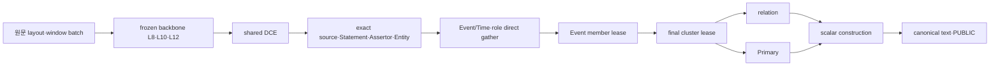

# 14번 request tensor 수명 계약

`V3ServingWorker.analyze`는 입력 원문 하나와 eval worker slot 하나를 소유한다. worker의 pinned weight/tokenizer는 startup에 한 번 로드된다. request는 `torch.no_grad()`이며 Gold target이나 training activation을 만들지 않는다. 모델 내부 tensor를 scalar `V3ConstructionResult` 또는 PUBLIC에 저장하지 않는다.

| Producer/owner | Consumer와 alias | 마지막 소비·해제 | 실패 경로 |
| --- | --- | --- | --- |
| `BackboneOutput`의 L8/L10/L12 | DCE와 `ExactSourceSpanBridge`; 각 layer tensor는 선택한 window view의 원 storage | 모든 decode·Entity resolution·Event/Time direct gather 후 `backbone_output=None` | request `finally`; backbone capture 자체는 `ContextVar` cleanup |
| `SharedForwardLease` token/sentence/document/proposal | endpoint·semantic·role·Assertor·Entity 및 direct gather가 같은 token tensor identity 소비 | `EventTimeFeatureLease` 생성 직후 `close()` | `finally.close()` |
| Statement/Assertor state map | source gather의 row view가 backing storage를 공유; Entity Assertor resolution → relation/Primary | 마지막 Primary 뒤 map `clear()` | request frame 종료 |
| `EventTimeFeatureLease` | Event/Time 및 extra Trigger/role/Entity row view가 하나의 encoded storage를 공유; normalization check·attachment·member 조립 | `EventMemberFeatureLease` 완성 직후 `close()` | `finally.close()` |
| `EventMemberFeatureLease` | channel sum/count, member state, role view; same-event scorer와 all-member final aggregation | final cluster lease 생성 직후 `close()` | `finally.close()` |
| `FinalClusterFeatureLease` | 관계와 Primary에 대한 typed view; member/role summary 포함 | `RELATION` release 후 `PRIMARY` release가 닫음 | `finally.close()` |
| pair chunk tensor | Entity coref, Event-Time, Event coref, ABOUT/CAUSES 각 bounded loop 로컬 | chunk 점수화 직후 함수 프레임 종료 | 함수 예외 프레임 종료 |
| canonicalizer source | request의 immutable 원문 string·scalar span | PUBLIC exact evidence 직렬화 후 frame 종료 | serializer 실패 시 frame 종료 |

`serving-audit-report.json`의 1,102자 engineering train 원문 run에서 owner별 backing storage census는 backbone+shared 7 view/7 storage/40,399,872 byte, Statement+Assertor 4 view/2 storage/4,096 byte, Event-Time 69 view/4 storage/31,068 byte, Event member 13 view/5 storage/58,464 byte, final cluster 9 view/9 storage/41,095 byte였다. 이는 각 시점의 **논리적 소유 storage** 합계이며 동시 peak/allocator RSS가 아니다. `data_ptr`는 중복 storage 계산에만 쓰고 audit/PUBLIC에 기록하지 않는다.

정상 요청은 owner 상태를 단계마다 검사하고 마지막 consumer 전에 닫히면 실패한다. 예외와 `KeyboardInterrupt`에서 `finally`가 살아 있는 lease를 닫고 forward hook을 제거한다. 3회 반복 요청에서 shared token, Event-Time, member, final tensor의 약한 참조 12개와 Statement/Assertor feature 참조가 `gc.collect()` 뒤 모두 해제됐다. 이 확인은 Python 참조 누출 검증이며 allocator가 즉시 OS에 RSS를 반환한다는 주장은 아니다. 빈 원문은 모델 호출 전에 거부한다. partial Event identity도 scalar 사실을 보존하고 owner를 해제한다. 학습 경로의 backward activation 수명은 기존 단계 8–13의 별도 lease·gradient 테스트 계약을 유지한다.
