# 별빛뉴스 시연 시나리오

## 1 홈 화면

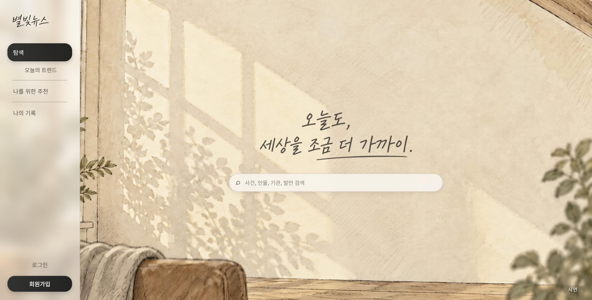

1. `https://j15e206.p.ssafy.io/`에 접속한다.
2. 화면 왼쪽 하단의 **로그인**을 클릭한다.

## 2 로그인 화면

1. 화면 중앙 로그인 용지의 **아이디** 입력란을 클릭한다.
2. 시연용 계정의 아이디를 입력한다.
3. 바로 아래 **비밀번호** 입력란을 클릭하고 비밀번호를 입력한다.

## 3 시연용 계정 로그인

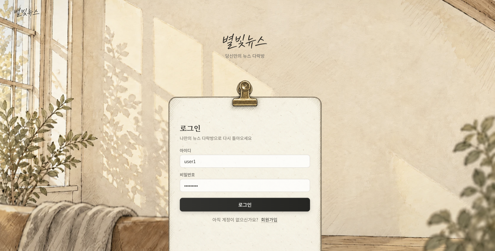

1. 아이디와 비밀번호가 입력되었는지 확인한다.
2. 입력란 아래의 검은색 **로그인** 버튼을 클릭한다.

## 4 로그인 후 오늘의 트렌드

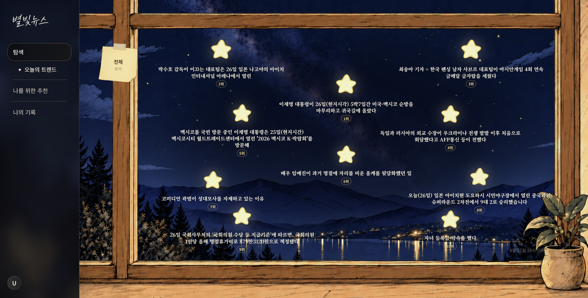

1. 로그인 후 **오늘의 트렌드** 화면으로 이동했는지 확인한다.
2. 화면 중앙에 전체 분야의 트렌드 이벤트가 순위와 함께 표시되는지 확인한다.

## 5 오늘의 트렌드 이벤트 선택

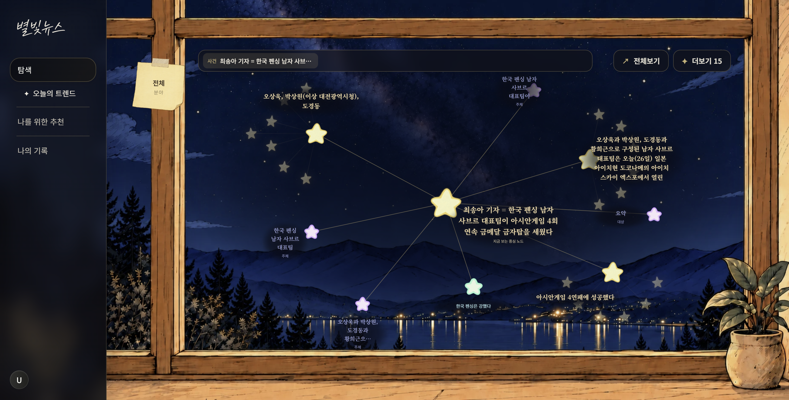

1. 오늘의 트렌드에서 **최송아 기자 = 한국 펜싱 남자 사브르 대표팀이 아시안게임 4회 연속 금메달 금자탑을 세웠다** 이벤트를 클릭한다.
2. 선택한 이벤트가 화면 중앙의 노란색 중심 노드로 표시되는지 확인한다.
3. 이벤트와 연결된 주변 사건, 인물·기관, 장소, 발언 노드가 연결선과 함께 표시되는지 확인한다.

## 6 연관 이벤트 노드 선택

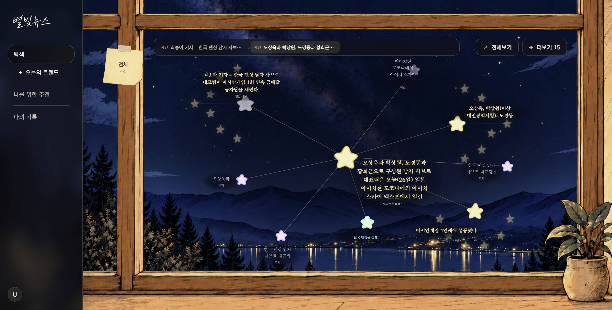

1. 중심 노드와 연결된 **오상욱과 박상원, 도경동과 황희근으로 구성된 남자 사브르 대표팀은 오늘 일본 아이치현 도코나메의 아이치 스카이 엑스포에서 열린** 이벤트 노드를 클릭한다.
2. 새로 선택한 이벤트가 화면 중앙의 노란색 중심 노드로 이동하는지 확인한다.
3. 기존 중심 노드는 왼쪽 위에서 회색 노드로 표시되는지 확인한다.
4. 화면 상단 탐색 경로에 이전 이벤트와 현재 이벤트가 순서대로 표시되는지 확인한다.

## 7 중심 노드의 관련 기사 확인

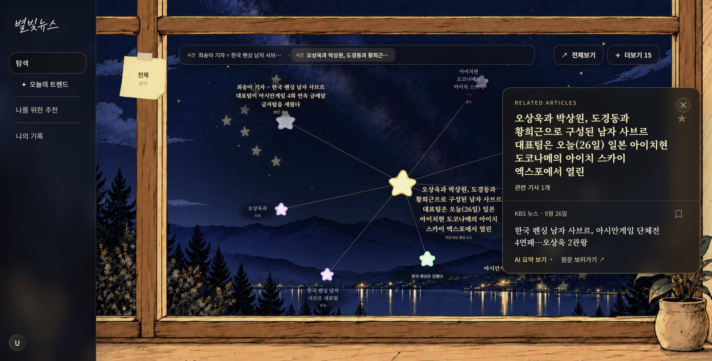

1. 화면 중앙의 노란색 중심 노드 또는 이벤트 제목을 클릭한다.
2. 화면 오른쪽에 **RELATED ARTICLES** 패널이 열리는지 확인한다.
3. 패널에서 관련 기사 수와 기사 제목, 언론사, 발행일을 확인한다.

## 8 기사 AI 요약 확인

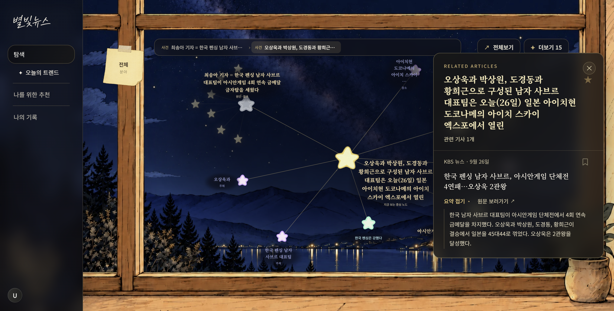

1. 관련 기사 항목 아래의 **AI 요약 보기**를 클릭한다.
2. 버튼이 **요약 접기**로 변경되는지 확인한다.
3. 선택한 기사의 요약 내용이 기사 항목 아래에 펼쳐지는지 확인한다.

## 9 토픽 선택 목록 열기

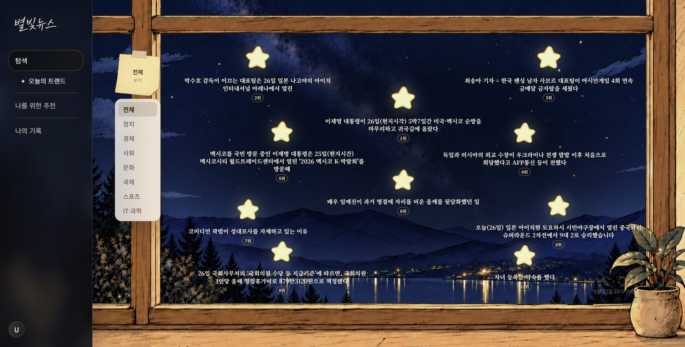

1. 왼쪽 메뉴의 **오늘의 트렌드**를 클릭해 트렌드 목록으로 돌아간다.
2. 화면 왼쪽 창틀에 붙어 있는 **전체 분야** 포스트잇을 클릭한다.
3. 포스트잇 아래에 전체, 정치, 경제, 사회, 문화, 국제, 스포츠, IT·과학 목록이 펼쳐지는지 확인한다.

## 10 정치 토픽 탐색

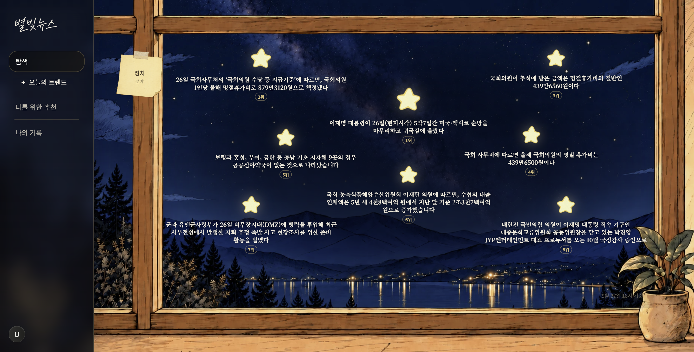

1. 펼쳐진 토픽 목록에서 **정치**를 클릭한다.
2. 포스트잇의 표시가 **전체**에서 **정치**로 변경되는지 확인한다.
3. 화면 중앙에 정치 분야의 트렌드 이벤트만 표시되는지 확인한다.

## 11 부캉이 검색

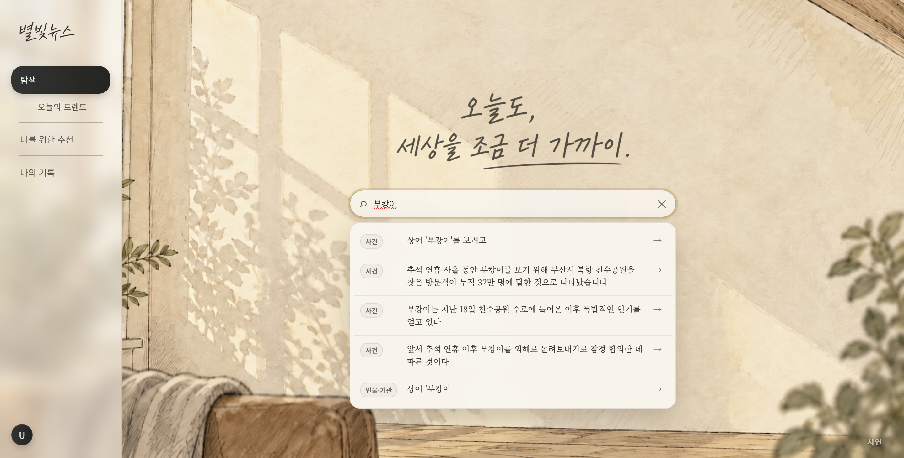

1. 화면 왼쪽 위의 **별빛뉴스 로고**를 클릭해 홈 화면으로 이동한다.
2. 화면 중앙의 `사건, 인물, 기관, 발언 검색` 입력창을 클릭한다.
3. 검색창에 `부캉이`를 입력한다.
4. 검색 결과에서 사건 결과들과 인물·기관 결과가 구분되어 표시되는지 확인한다.
5. 검색 결과 하단의 **인물·기관 상어 '부캉이** 항목을 클릭한다.

## 12 부캉이 엔티티부터 탐색 시작

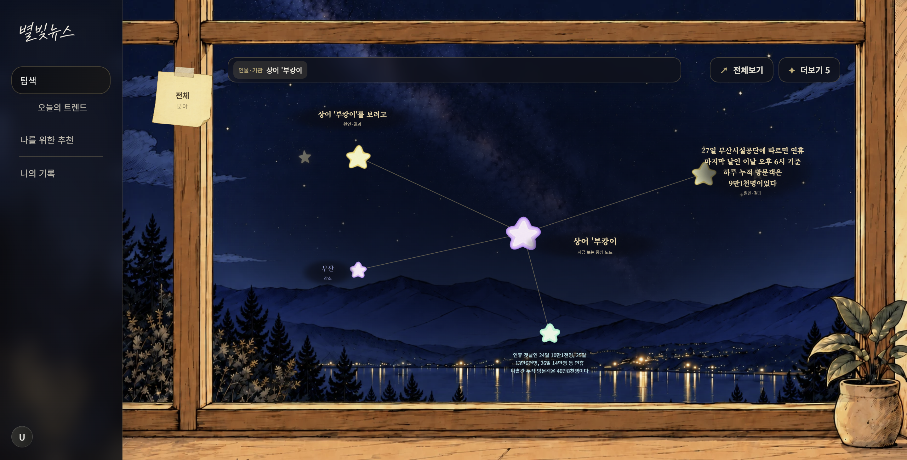

1. 검색한 **상어 '부캉이** 엔티티가 화면 중앙의 보라색 중심 노드로 표시되는지 확인한다.
2. 부캉이와 연결된 사건과 장소 노드가 연결선과 함께 표시되는지 확인한다.
3. 연결된 노드를 클릭하면 해당 노드를 중심으로 탐색을 이어갈 수 있다.

## 13 나를 위한 추천 페이지

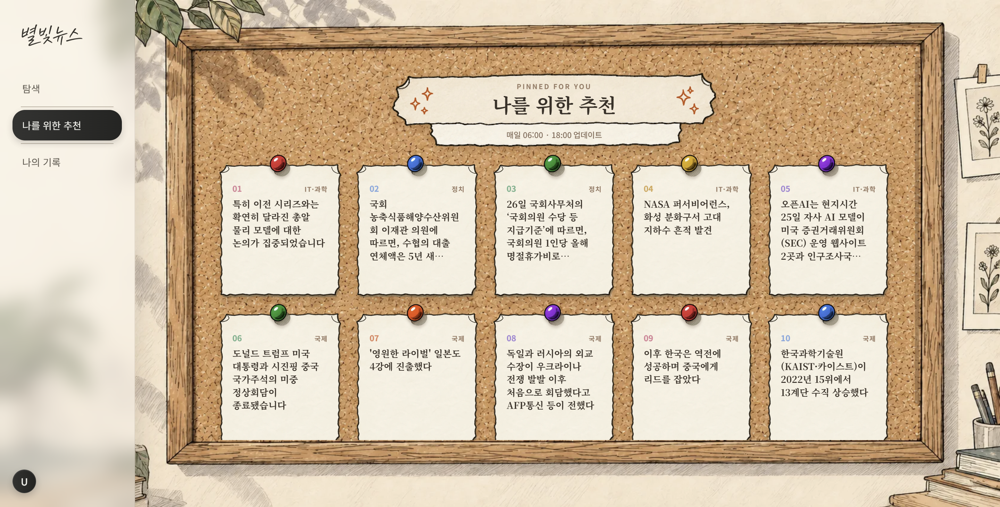

1. 화면 왼쪽 메뉴의 **나를 위한 추천**을 클릭한다.
2. 코르크 보드에 추천 이벤트 카드가 순서대로 표시되는지 확인한다.
3. 확인할 추천 이벤트 카드 하나를 클릭한다.

## 14 추천 이벤트 상세 확인

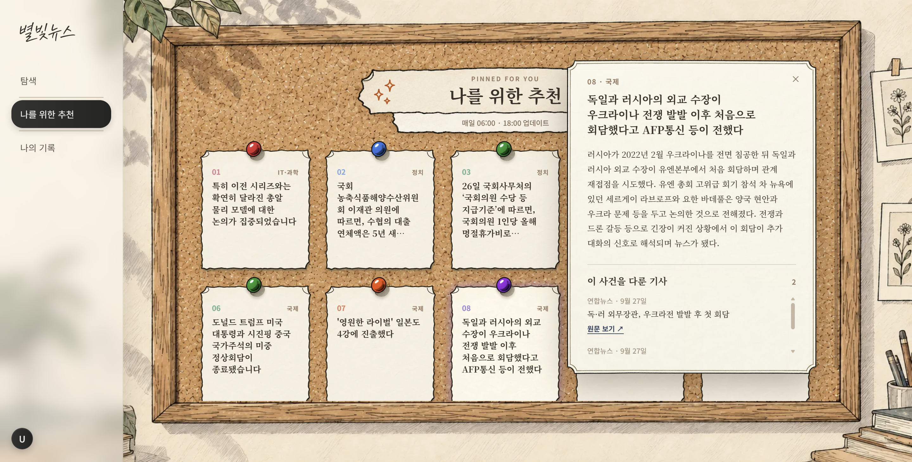

1. 선택한 카드 오른쪽에 이벤트 상세 용지가 펼쳐지는지 확인한다.
2. 상세 용지 상단에서 이벤트 제목과 이벤트 요약을 확인한다.
3. **이 사건을 다룬 기사** 영역에서 관련 기사 수와 기사 목록을 확인한다.
4. 필요한 경우 기사 항목의 **원문 보기**를 클릭한다.

## 15 나의 기록 페이지

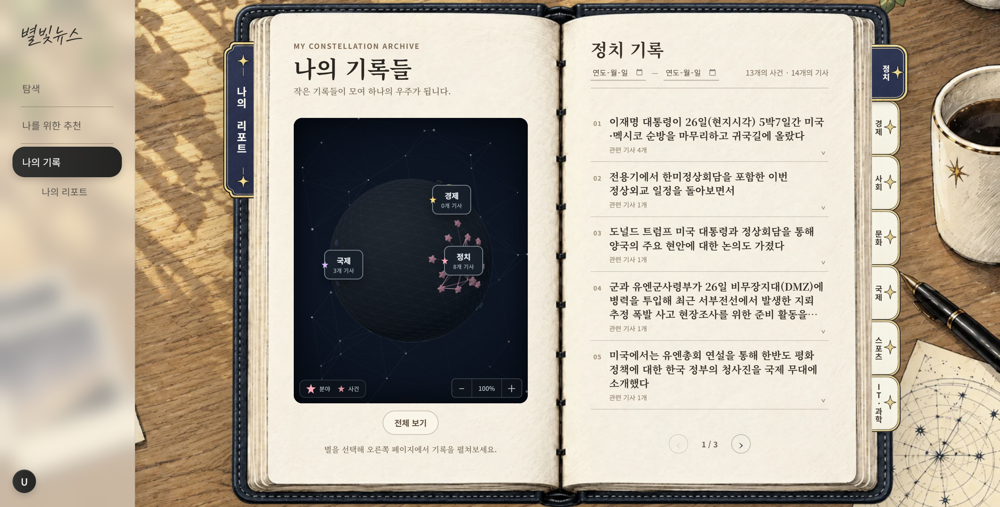

1. 화면 왼쪽 메뉴의 **나의 기록**을 클릭한다.
2. 왼쪽 페이지에서 개인 기록 그래프를 확인한다.
3. 오른쪽 가장자리의 정치, 경제, 사회, 문화, 국제, 스포츠, IT·과학 책갈피 중 확인할 분야를 클릭한다.
4. 오른쪽 페이지에서 선택한 분야의 사건 기록과 관련 기사 수를 확인한다.

## 16 나의 기록 상세 확인

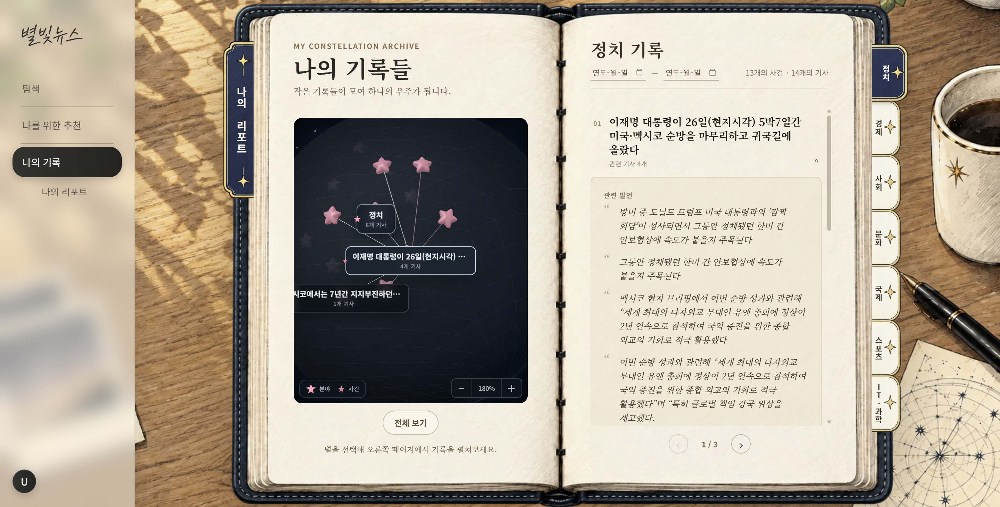

1. 오른쪽 기록 목록에서 확인할 사건 항목을 클릭한다.
2. 선택한 사건 항목 아래에 **관련 발언** 영역이 펼쳐지는지 확인한다.
3. 왼쪽 개인 기록 그래프에서 선택한 사건 노드와 연결 노드가 강조되는지 확인한다.

## 17 나의 리포트 화면

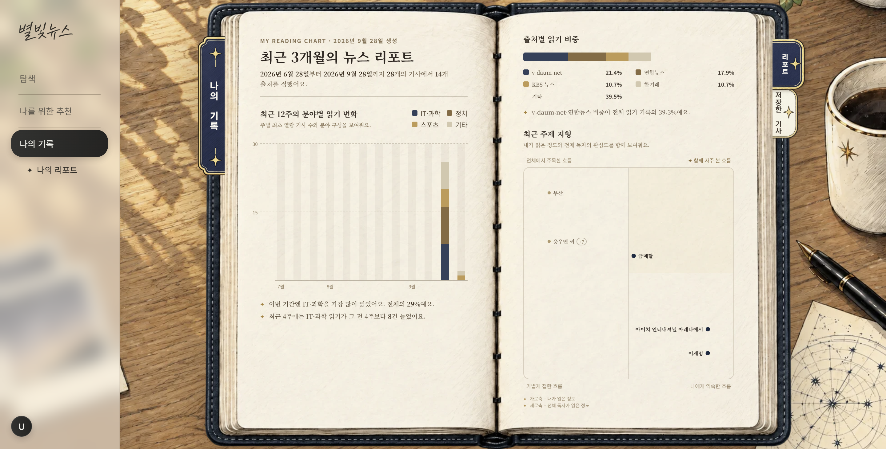

1. 나의 기록 화면 왼쪽의 **나의 리포트**를 클릭한다.
2. 최근 3개월 동안 읽은 기사 수를 확인한다.
3. 왼쪽 페이지에서 **최근 12주의 분야별 읽기 변화**를 확인한다.
4. 오른쪽 페이지에서 **출처별 읽기 비중**과 **최근 주제 지형**을 확인한다.

## 18 저장한 기사 확인

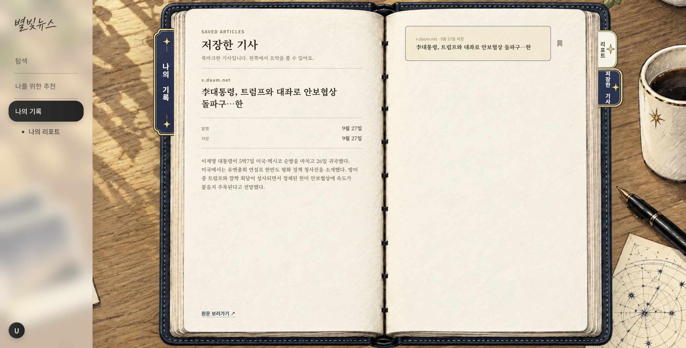

1. 리포트 오른쪽 가장자리의 **저장한 기사** 책갈피를 클릭한다.
2. 오른쪽 페이지의 저장한 기사 목록에서 기사 하나를 클릭한다.
3. 왼쪽 페이지에서 선택한 기사의 언론사, 제목, 발행일, 저장일과 요약을 확인한다.
4. 기사 원문을 확인하려면 왼쪽 아래의 **원문 보러가기**를 클릭한다.
